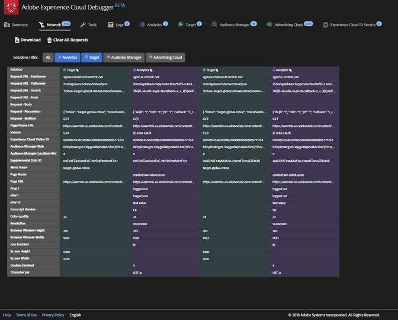

# 網路資訊{#network-information}

若要檢視網路資訊，請按一下「**[!UICONTROL Network]**」。

網路畫面會彙總頁面上發出的所有 Adobe Experience Cloud 解決方案呼叫，並由左到右依序顯示。標準參數會自動加上好記名稱的標示，並將相同角色的常見參數編排為分組顯示。

>[!TIP]
>
>此畫面非常實用，可確認用於整合的參數 (例如 Experience Cloud 訪客 ID 或補充資料 ID) 在各個整合之間是否一致。

>[!NOTE]
>
>目前並非解決方案呼叫中傳遞的所有參數 (例如 Analytics 內容變數、Target 自訂參數或 Experience Cloud ID 服務客戶 ID) 都會顯示在網路畫面中。

若要檢視所有資訊，請選取「**[!UICONTROL All]**」。

您也可以依解決方案篩選資訊。選取您要檢視的解決方案。您可以同時檢視多個解決方案。系統會強調顯示選取的解決方案篩選器。

按一下網路視圖中的項目以檢視其放大畫面。從展開的視圖視窗中，您可以將顯示的資訊複製到剪貼簿。

使用每個欄頂端的圖示來將伺服器呼叫 URL 複製到剪貼簿，您可以將剪貼簿中的內容貼到另一個文件進行參照或除錯。

