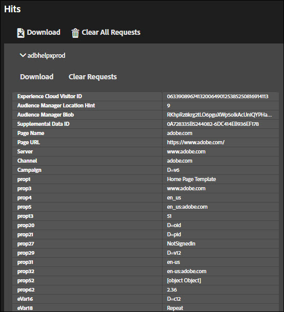

# 解決方案標籤{#solution-tabs}

按一下解決方案標籤以查看特定 Adobe Experience Cloud 解決方案的結果。

## Analytics {#section-f71dfcc22bb44c86bec328491606a482}

Analytics 標籤會提供您的 [Analytics](https://docs.adobe.com/content/help/zh-Hant/analytics/landing/home.html) 實作相關資訊。

**點擊**

根據預設，會以收合狀態呈現向同一個報表套裝所發出的所有伺服器呼叫。

**下載**：以 Excel 試算表形式下載與所有顯示的報表套裝相關的資訊。

**清除所有請求**：從 Analytics 檢視中移除所有顯示的請求。清除請求後，新請求將在發生時顯示。

按一下報表套裝 ID 以展開檢視：

此畫面會顯示自開啟 Debugger 後或清除請求後的所有請求。預設參數會自動對映至好記名稱。如果您使用「連結 Analytics」功能 (請參閱以下所述) 進行驗證，[Prop 和 eVar](https://docs.adobe.com/content/help/zh-Hant/analytics/implementation/vars/page-vars/evar.html) 變數可對映至自訂好記名稱 (例如「prop1」可顯示為「使用者類型」)。系統會依序由左到右顯示各項請求。

**下載**：將對報表套裝提出的所有請求儲存為 Excel 試算表。

**清除請求**：移除對此報表套裝提出的所有請求。新請求會在發生時顯示。

**連結帳戶 (舊版)**

按一下「**[!UICONTROL Link Account]**」，然後輸入請求的資訊，將 Analytics 帳戶連結至 Debugger。

>[!NOTE]
>
>目前只有舊版 Analytics 使用者登入憑證才能支援此功能。

**擷取處理後點擊**

若要在執行處理規則後查看 Analytics 點擊上的值，請啟用擷取處理後點擊選項。您必須登入 Adobe Experience Cloud 才能使用此功能。

啟用此選項後，除錯參數則會新增至 Analytics 請求。系統會像處理任何其他點擊一樣繼續處理這些點擊。Debugger 會輪詢 Analytics 除錯 API，擷取具有原始點擊 ID 之任何點擊的處理後規則值。處理後點擊具有紫色背景，而且會顯示在原始點擊旁邊。

針對大多數 Analytics 實作，可在幾分鐘內提供處理後規則資訊。Analytics for Target (A4T) 實作需要的時間會長很多。

## Target {#section-988873ba5ede4317953193bd7ac5474c}

使用 Target 標籤檢視 [Target](https://docs.adobe.com/content/help/zh-Hant/target/using/target-home.html) 請求或 [Mbox 追蹤](https://docs.adobe.com/content/help/zh-Hant/target/using/activities/troubleshoot-activities/content-trouble.html)回應詳細資料。

按一下「**[!UICONTROL Requests]**」，然後展開環境以檢視 Target 的相關資訊。

按一下「**[!UICONTROL Clear All Requests]**」，移除目前顯示的請求。將會在發出更多請求時顯示。

您也可以使用 Target 篩選器來[啟用 Target 除錯用途的 MBox 追蹤](https://docs.adobe.com/content/help/zh-Hant/target/using/activities/troubleshoot-activities/content-trouble.html)。

您必須有一個通過 Experience Cloud 驗證的已開啟 Chrome 標籤，才能啟用 Mbox 追蹤。啟用後，就會顯示您的 Adobe ID 使用者名稱。展開您的使用者名稱，顯示與您可存取之 Experience Cloud 組織相關聯的 Target 用戶端代碼。按一下您要啟用 Mbox 追蹤的用戶端代碼，並確認綠色勾號是否出現。現在將會顯示含有 Mbox 追蹤資訊的所有 Target 請求 (依用戶端代碼分組)。若要探索 Mbox 追蹤資訊，請展開請求以查看標籤：

* [活動](https://docs.adobe.com/content/help/zh-Hant/target/using/activities/activities.html) 活動標籤會顯示與 Target 請求名稱相關聯的所有活動 (無論您是否符合活動資格)。「符合的活動」是您符合資格的活動，並在回應中提供的選件。您可以展開活動名稱，確認您加入的體驗，以及哪些對象和目標定位條件讓您符合該活動的資格。「評估的活動」是所有已評估的活動 (無論您是否符合資格)。若要針對您為何不符合某項已「評估」但不「符合」之活動的資格進行疑難排解，請展開活動名稱並檢閱「不符合的對象」區段。

* 請求

   [Mbox 追蹤](https://docs.adobe.com/content/help/zh-Hant/target/using/activities/troubleshoot-activities/content-trouble.html)的請求標籤與主要請求標籤類似。除了請求標題以外，您還可以檢視 Target 請求傳遞的所有參數。
* 設定檔

   展開設定檔快照以查看儲存的[設定檔資訊](https://docs.adobe.com/content/help/zh-Hant/target/using/audiences/visitor-profiles/variables-profiles-parameters-methods.html)，瞭解您在 Target 設定檔資料庫中身為訪客的相關資訊。這裡會顯示所有 mbox 內和指令碼設定檔，以及一些系統設定檔。狀態欄會顯示哪些設定檔已在此請求範圍內變更，及其在請求進入設定檔系統前/後的值。
* Audience Manager

   Audience Manager 標籤的「segmentIds」和「cachedSegmentIds」區段會顯示從 Experience Cloud 共用至 Target 的[對象](https://docs.adobe.com/content/help/zh-Hant/target/using/audiences/target.html) Id，以及您符合資格的 ID。這些可能是在 Audience Manager、Analytics 或 People 核心服務的 Audience 建立器中建立的對象。只要在 Audience Manager 使用者介面中查詢這些 ID，即可找出對象名稱。

以下影片說明一般的 Target 功能：

>[!VIDEO](https://video.tv.adobe.com/v/23115t2/?captions=chi_hant)

以下影片說明 Mbox 追蹤：

>[!VIDEO](https://video.tv.adobe.com/v/23113t2/?captions=chi_hant)

## Audience Manager {#section-1d4484f8b46f457f859ba88039a9a585}

使用 [Audience Manager](https://docs.adobe.com/content/help/zh-Hant/audience-manager/user-guide/aam-home.html) 標籤檢視[事件](https://docs.adobe.com/content/help/zh-Hant/audience-manager/user-guide/api-and-sdk-code/dcs/dcs-event-calls/dcs-event-calls.html)的詳細資料。按一下組織以將其展開並顯示資訊。

按一下「**[!UICONTROL Clear All Events]**」，重設顯示的資訊。新事件將在發生時隨即顯示。

**ID 同步**

ID 同步是內送、非同步資料傳輸程序中的第一個步驟。在此步驟中，Audience Manager 和供應商會比較並比對其個別網站訪客的 ID。

如需詳細資訊，請參閱 Audience Manager 產品文件中的[內送資料傳輸的 ID 同步](https://docs.adobe.com/content/help/zh-Hant/audience-manager/user-guide/implementation-integration-guides/sending-audience-data/batch-data-transfer-process/id-sync-http.html)。

## Advertising Cloud {#section-ee80a9c509f2462c89c1e5bd8d05d7c8}

使用 Advertising Cloud 標籤檢視 Advertising Cloud 請求。

按一下「**[!UICONTROL Requests]**」，然後展開環境以檢視 Advertising Cloud 的相關資訊。

按一下「**[!UICONTROL Clear All Requests]**」，移除目前顯示的請求。將會在發出更多請求時顯示。

## Experience Cloud ID 服務 {#section-a96c32f8e63a4991abb296f6e8ea01cf}

使用 Experience Cloud ID 服務標籤檢視 [Experience Cloud ID 服務](https://docs.adobe.com/content/help/zh-Hant/id-service/using/home.html)請求。

按一下「**[!UICONTROL Requests]**」，然後展開環境以檢視 Experience Cloud ID 服務的相關資訊。

按一下「**[!UICONTROL Clear All Requests]**」，移除目前顯示的請求。將會在發出更多請求時顯示。
