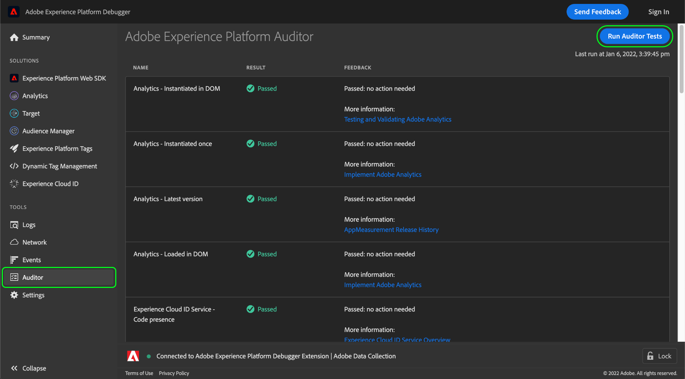

# Auditor索引標籤

在Adobe Experience Platform Debugger中，您可以使用 **[!UICONTROL Auditor]** 索引標籤以在您的頁面上執行一系列稽核測試。

若要使用此功能：

1. 選取 **[!UICONTROL Auditor]** 左側導覽列中。
1. 選擇「**[!UICONTROL Run Auditor Tests]**」。測試完成後，其結果會顯示於下方。

結果清單會顯示測試項目及其結果，並提供解決問題的相關建議。

## 解讀測試結果

每項測試都會加權，而您的測試分數會等於指派的權重。 如果您通過權重為5的測試，則會獲得5分。

| 分數 | 說明 |
| --- | --- |
| 0 | 警示您應留意的問題，但不影響您的分數。 |
| 1 | 建議最佳化。 不影響資料正確性。 |
| 2 | 若未通過此測試，表示您將無法存取Adobe Experience Cloud中的最新功能和修正。 |
| 3 | 測試效率，以及實作是否遵循最佳實務准則。 |
| 4 | 若未通過，表示您可能正在收集不可靠的資料。 |
| 5 | 失敗表示您可能會看到資料遺失。 |

所有測試都會通過或失敗。 測試目的在於確認是否符合測試條件，因此並不會因為部分符合而獲得部分分數。例如，如果測試檢查您是否有最新版的 Adobe 解決方案，而您只比最新版本舊一個版本，您得到的分數仍會與舊五個版本相同。最新版本包含效能改進和錯誤修正，因此建議使用最新版本。

**強烈建議**&#x200B;您修正層級 4 或層級 5 的結果。

**建議**&#x200B;您修正層級 1 到層級 3 的結果。

## 支援的Adobe技術

Auditor功能可對下列Adobe技術評分：

* Adobe Advertising Cloud DSP
* Adobe Advertising Cloud Search
* Adobe Analytics
* Adobe Experience Cloud Identity Service
* Adobe Target
* 標籤(前身為Adobe Experience Platform Launch)

## 測試規則

如需此功能所提供測試規則的詳細資訊，請參閱下列檔案：

* [標記一致性](./tag-consistency.md)
* [標記是否存在](./tag-presence.md)
* [設定](./configuration.md)
* [警報](./alerts.md)
