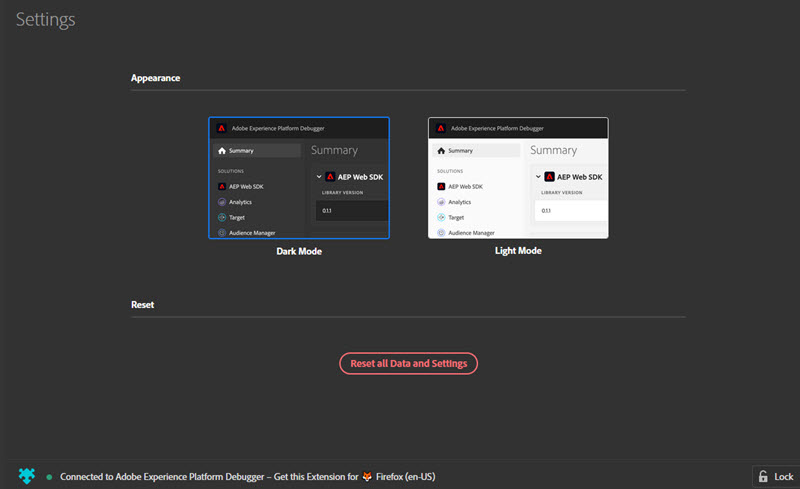
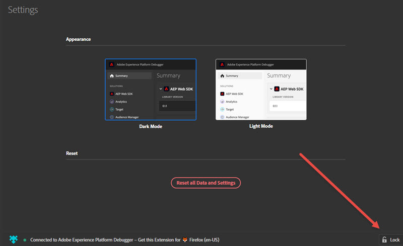

# 設定 Debugger

>[!IMPORTANT]
>
>Adobe Experience Platform Debugger 目前仍在測試階段。文件和功能可能會有所變更。

您可以調整 Experience Platform Debugger 外觀和運作方式的某些設定。

## 淺色或深色模式

 Platform Debugger 開啟後，您可以前往「**[!UICONTROL Settings]**」選取&#x200B;**「深色模式」**(預設值) 或&#x200B;**「淺色模式」**，以使用您偏好的外觀。

## 重設

按一下「**[!UICONTROL Reset all Data and Settings]**」可返回清除所有資料，並恢復預設設定。

## 將 Experience Platform Debugger 鎖定在單一頁面

在您變更網站頁面後，Experience Platform Debugger 視窗會隨之更新，顯示該頁面的實際資訊。畫面底部會顯示您所連線的頁面名稱。若要將 Platform Debugger 鎖定在單一頁面，請按一下 Experience Platform Debugger 視窗右下角的「**[!UICONTROL Lock]**」。

如果在頁面偵錯期間，您需要在其他頁面上閱讀文件或檢視資訊，這個功能會很有幫助。