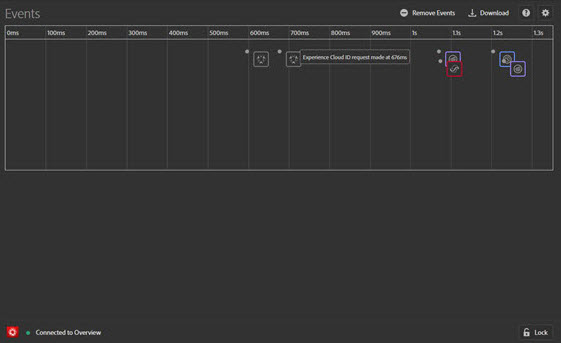
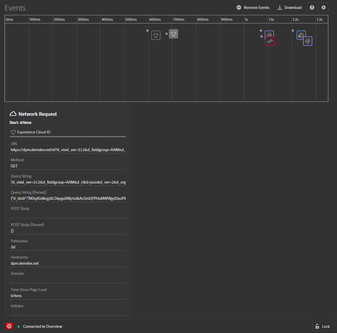
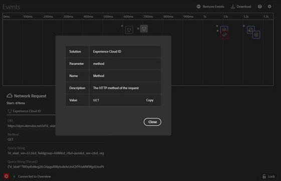
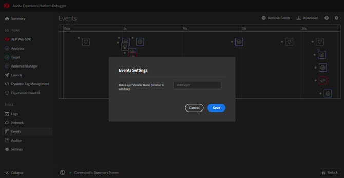

# 事件{#events}

>[!IMPORTANT]
>
>Adobe Experience Platform Debugger 目前仍在測試階段。文件和功能可能會有所變更。

「事件」畫面會以圖形化方式呈現所發生的事件，將事件顯示在時間軸上。

時間軸上會對應每個事件，顯示適用的解決方案圖示。圖示也會顯示資料層的變更情形 (若已啟用)。將滑鼠指標停留在圖示上，即可查看事件摘要。按一下事件即可取得詳細資訊。您可以按住 Shift 或 Control 鍵並按一下，以檢視多個事件。

按一下詳細資訊，即可查看詳細資訊。

## 追蹤資料層變更情形

若要在時間軸中啟用資料層變更追蹤功能：

1. 按一下右上方的齒輪圖示。
1. 輸入資料層名稱。

   

1. 按一下「**[!UICONTROL Save]**」。

所有已刪除或新增的內容，都能從資料層變更的詳細資訊中一覽無遺。若要深入了解資料層，您可以按一下 **{}**。

## 下載事件資訊

按一下 **[!UICONTROL Download]**，即可下載詳載頁面呼叫相關資訊的 Excel 檔案。