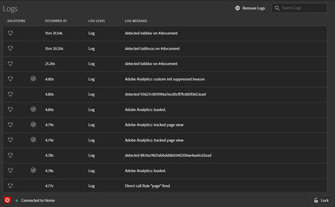

# 記錄檔{#logs}

>[!IMPORTANT]
>
>Adobe Experience Platform Debugger 目前仍在測試階段。文件和功能可能會有所變更。

「記錄檔」畫面提供 DTM、Adobe Experience Platform Launch 和 Adobe Experience Platform Web SDK 實作的專屬資訊。您不需要啟用 DTM 適用的主控台除錯工具，即可顯示此資訊。您可以透過解決方案的相關聯工具，依已實作的解決方案加以篩選。

「記錄檔」畫面會以四欄顯示資訊：

**[!UICONTROL Solutions]：**&#x200B;顯示受記錄項目影響的 Experience Cloud 解決方案圖示。將滑鼠指標暫留在圖示上即可取得文字說明。

**[!UICONTROL Occurred at]：**&#x200B;顯示工作階段期間發生的記錄問題。

**[!UICONTROL Log level]：**&#x200B;顯示問題的嚴重程度。嚴重程度會是以下任一項：

* 記錄檔
* 資訊
* 警告
* 錯誤

**[!UICONTROL Log message]：**&#x200B;說明問題。

某些記錄檔訊息包含「顯示代碼」選項。按一下「**[!UICONTROL Show Code]**」即可檢視條件式程式碼，決定是否應引發規則。

若要清除日誌，請按一下「**[!UICONTROL Remove Logs]**」。
