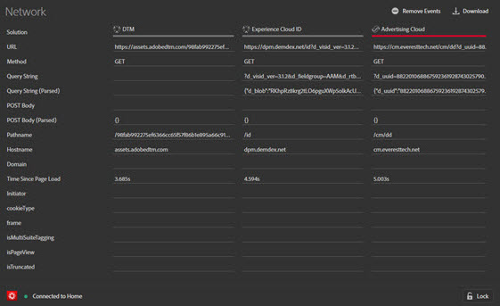
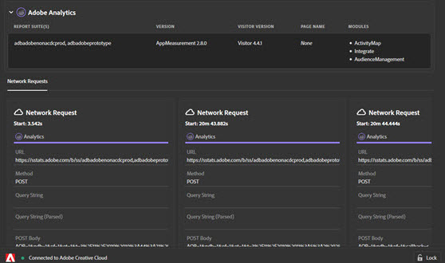
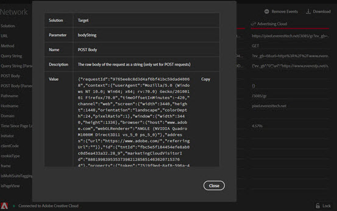

# 網路資訊{#network-information}

To view Network information, click **[!UICONTROL Network]**.

網路畫面會彙總頁面上發出的所有 Adobe Experience Cloud 解決方案呼叫，並由左到右依序顯示。標準參數會自動加上好記名稱的標示，並將相同角色的常見參數編排為分組顯示。

此螢幕對於確認整合使用的參數（例如Experience cloud訪客ID或補充資料ID）在整合中是否一致很有用。

>[!NOTE]
>
>目前並非解決方案呼叫中傳遞的所有參數 (例如 Analytics 內容變數、Target 自訂參數或 Experience Cloud ID 服務客戶 ID) 都會顯示在網路畫面中。

若要依解決方案篩選資訊，請從左側導覽的清單中選取您要檢視的解決方案。 篩選下列範例以僅顯示Analytics:

若要返回顯示所有解決方案，請按一下 **[!UICONTROL Network]**

按一下「網路」檢視中的項目，以檢視擴充檢視。 從展開的視圖視窗中，您可以將顯示的資訊複製到剪貼簿。

<!--Use the icon at the top of each column to copy the server call URL to your clipboard, where you can paste it into another document for reference or debugging purposes.

-->

要清除清單，請按一下 **[!UICONTROL Remove Events]**。

若要下載包含此螢幕上資訊的Excel檔案，請按一下 **[!UICONTROL Download]**。