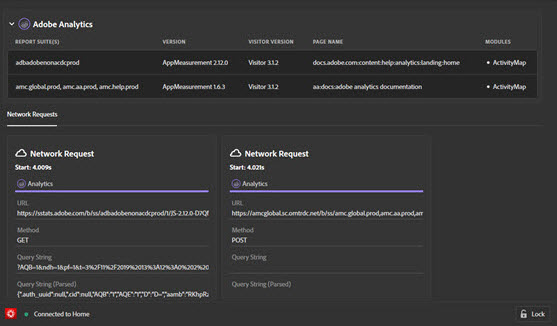

# 解決方案{#solution-tabs}

> [!IMPORTANT]
>
> Adobe Experience Cloud Debugger 2.0目前正在測試中。 說明檔案和功能可能會有所變更。

按一下解決方案，即可查看特定 Adobe Experience Cloud 解決方案的結果。

## AEP Web SDK {#aep}

AEP Web SDK 畫面會顯示 Adobe Experience Platform Web SDK 的相關資訊。按一下 **[!UICONTROL Configure]**，即可開啟或關閉主控台登入頁面。

## Analytics {#section-f71dfcc22bb44c86bec328491606a482}

Analytics 畫面會提供您 [Analytics](https://docs.adobe.com/content/help/en/analytics/landing/home.html) 實作的相關資訊。

## Target {#section-988873ba5ede4317953193bd7ac5474c}

使用「目標」畫面可檢視 [Target](https://docs.adobe.com/content/help/en/target/using/target-home.html) 請求<!-- or [Mbox Trace](https://docs.adobe.com/content/help/en/target/using/activities/troubleshoot-activities/content-trouble.html) response details-->。

## Audience Manager {#section-1d4484f8b46f457f859ba88039a9a585}

使用 [Audience Manager](https://docs.adobe.com/content/help/en/audience-manager/user-guide/aam-home.html) 標籤檢視[事件](https://docs.adobe.com/content/help/en/audience-manager/user-guide/api-and-sdk-code/dcs/dcs-event-calls/dcs-event-calls.html)的詳細資料。按一下組織以將其展開並顯示資訊。

## Launch {#section-ee80a9c509f2462c89c1e5bd8d05d7c8}

Launch 區段可供檢視 Launch 請求。您也可以按一下 **[!UICONTROL Configuration]**，設定[內嵌程式碼](https://docs.adobe.com/content/help/en/launch/using/reference/upgrade/link-dtm-embed-code.html)。您可以在 Debugger 中編輯、替換或新增更多內嵌程式碼。如果您登入，您可以使用下拉式清單選取替代屬性。

## Dynamic Tag Management {#dynamic-tag-management}

Dynamic Tag Management 區段可供檢視 DTM 請求。您也可以按一下 **[!UICONTROL Configuration]**，設定[內嵌程式碼](https://docs.adobe.com/content/help/en/dtm/using/client-side/code.html)。

## Experience Cloud ID 服務 {#section-a96c32f8e63a4991abb296f6e8ea01cf}

使用 Experience Cloud ID 服務標籤檢視 [Experience Cloud ID 服務](https://docs.adobe.com/content/help/en/id-service/using/home.html)請求。