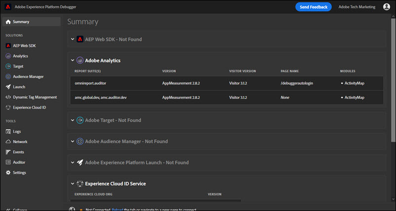

# 摘要頁籤

要運行Adobe Experience Platform調試器，請開啟要在瀏覽器中檢查的頁面，然後選擇表徵圖()。 在 **摘要** 頁籤。

此畫面會顯示各種 Adobe Experience Cloud 解決方案的相關資訊。顯示的資訊會依解決方案而異，但通常包括解決方案程式庫和版本 (例如「AppMeasurement 2.9 版」) 和帳戶 ID (例如 Analytics 報表套裝 ID、Target 用戶端代碼、Audience Manager 合作夥伴 ID 等) 的相關資訊。

## Experience Platform Debugger 中顯示的資訊

Experience Platform Debugger 針對各個解決方案顯示的資訊如下：

**Adobe Analytics**

<table id="table_BEB9CC58E59D4D86BC895A8A51D84A2C"> 
 <tbody> 
  <tr> 
   <td colname="col1"> 
報表套裝 
 </td> 
   <td colname="col2"> 
<a href="https://experiencecloud.adobe.com/resources/help/zh_TW/reference/report_suites_admin.html" format="html" scope="external">報表套裝</a>可全面而獨立地定義針對選定網站、一組網站或網頁子集的報告。 
 </td> 
  </tr> 
  <tr> 
   <td colname="col1"> 
版本 
 </td> 
   <td colname="col2"> 
針對頁面定義的 <a href="https://experiencecloud.adobe.com/resources/help/zh_TW/sc/implement/appmeasure_mjs.html" format="html" scope="external">AppMeasurement</a> 版本 
 </td> 
  </tr> 
  <tr> 
   <td colname="col1"> 
訪客版本 
 </td> 
   <td colname="col2"> 
<a href="https://experiencecloud.adobe.com/resources/help/zh_TW/sc/implement/visid_analytics.html" format="html" scope="external">訪客 ID</a> 程式庫的版本。 
 </td> 
  </tr> 
  <tr> 
   <td colname="col1"> 
頁面名稱 
 </td> 
   <td colname="col2"> 
傳送至 Analytics 的 <a href="https://experiencecloud.adobe.com/resources/help/zh_TW/sc/implement/pageName.html" format="html" scope="external">pageName</a> 變數，包含網站的好記名稱。 
 </td> 
  </tr> 
  <tr> 
   <td colname="col1"> 
模組 
 </td> 
   <td colname="col2"> 
Adobe Analytics 載入的模組 
 </td> 
  </tr> 
 </tbody> 
</table>

**Audience Manager**

<table id="table_784AEABADBDA4D14BB9A7A9CB9EF07C3"> 
 <tbody> 
  <tr> 
   <td colname="col1"> 
合作夥伴 
 </td> 
   <td colname="col2"> 
DIL 例項的<a href="https://experiencecloud.adobe.com/resources/help/zh_TW/aam/r_dil_get_partner.html" format="html" scope="external">合作夥伴名稱</a> 
 </td> 
  </tr> 
  <tr> 
   <td colname="col1"> 
版本 
 </td> 
   <td colname="col2"> 
DIL 例項的<a href="https://experiencecloud.adobe.com/resources/help/zh_TW/aam/r_api_return_versions_dil.html" format="html" scope="external">版本號碼</a> 
 </td> 
  </tr> 
  <tr> 
   <td colname="col1"> 
UUID 
 </td> 
   <td colname="col2"> 
與 DIL 例項相關聯的<a href="https://experiencecloud.adobe.com/resources/help/zh_TW/aam/ids-in-aam.html" format="html" scope="external">不重複的使用者 ID</a> 
 </td> 
  </tr> 
 </tbody> 
</table>

**Adobe Experience Platform標籤**

<table id="table_E9574975444A407887E26514D1BB1601"> 
 <tbody> 
  <tr> 
   <td colname="col1"> 
名稱 
 </td> 
   <td colname="col2"> 
標籤的名稱 <a href="https://experienceleague.adobe.com/docs/experience-platform/tags/admin/companies-and-properties.html" format="https" scope="external"> 屬性</a> 
 </td> 
  </tr> 
  <tr> 
   <td colname="col1"> 
版本 
 </td> 
   <td colname="col2"> 
Turbine 版本</a> 
 </td> 
  </tr> 
  <tr> 
   <td colname="col1"> 
建置日期 
 </td> 
   <td colname="col2"> 
標籤 <a href="https://experienceleague.adobe.com/docs/experience-platform/tags/publish/libraries.html" format="https" scope="external"> 庫</a> 生成日期 
 </td> 
  </tr> 
  <tr> 
   <td colname="col1"> 
環境 
 </td> 
   <td colname="col2"> 
的 <a href="https://experienceleague.adobe.com/docs/experience-platform/tags/publish/environments/environments.html" format="https" scope="external"> 環境</a> 由標籤庫使用 
 </td> 
  </tr> 
  <tr> 
   <td colname="col1"> 
擴充功能 
 </td> 
   <td colname="col2"> 
頁面所使用的擴充功能 
 </td> 
  </tr> 
 </tbody> 
</table>

**Adobe Experience Platform Web SDK**

<table id="table_DC76D63FA6EF4891906B9E1D3E4A8A6C"> 
 <tbody> 
  <tr> 
   <td colname="col1"> 
程式庫版本 
 </td> 
   <td colname="col2"> 
Adobe Experience Platform Web SDK <a href="https://experienceleague.adobe.com/docs/experience-platform/edge/extension/web-sdk-ext-release-notes.html" format="html" scope="external">程式庫版本</a>號碼 
 </td> 
  </tr> 
  <tr> 
   <td colname="col1"> 
命名空間
 </td> 
   <td colname="col2"> 
擴充功能的識別名稱
 </td> 
  </tr> 
  <tr> 
   <td colname="col1"> 
屬性 ID 
 </td> 
   <td colname="col2"> 
擴展中指定的標籤屬性的名稱 
 </td> 
  </tr> 
  <tr> 
   <td colname="col1"> 
邊緣網域 
 </td> 
   <td colname="col2"> 
Adobe Experience Platform 擴充功能傳送及接收資料的網域 
 </td> 
  </tr> 
  <tr> 
   <td colname="col1"> 
IMS 組織 ID 
 </td> 
   <td colname="col2"> 
您要在 Adobe 傳送資料的組織 (如同擴充功能中所指定) 
 </td> 
  </tr> 
  <tr> 
   <td colname="col1"> 
啟用記錄功能 
 </td> 
   <td colname="col2"> 
指定是否已為此屬性啟用記錄功能
 </td> 
  </tr> 
 </tbody> 
</table>

**Adobe Experience Cloud ID 服務**

<table id="table_274CFCEFA8F34D16BB546B4669EC0209"> 
 <tbody> 
  <tr> 
   <td colname="col1"> 
Experience Cloud 組織 ID 
 </td> 
   <td colname="col2"> 
您的<a href="https://experiencecloud.adobe.com/resources/help/zh_TW/mcvid/" format="https" scope="external">組織 ID</a> 
 </td> 
  </tr> 
  <tr> 
   <td colname="col1"> 
版本 
 </td> 
   <td colname="col2"> 
<a href="https://experiencecloud.adobe.com/resources/help/en_US/sc/implement/visid_analytics.html" format="html" scope="external">訪客 ID</a> 程式庫版本 
 </td> 
  </tr> 
 </tbody> 
</table>

**Adobe Target**

<table id="table_D30E0CD20FB04E41862B22655136E043"> 
 <tbody> 
  <tr> 
   <td colname="col1"> 
用戶端代碼 
 </td> 
   <td colname="col2"> 
您的 Target <a href="https://experienceleague.adobe.com/docs/target/using/implement-target/client-side/at-js-implementation/deploy-at-js/implementing-target-without-a-tag-manager.html" format="html" scope="external">用戶端代碼</a> 
 </td> 
  </tr> 
  <tr> 
   <td colname="col1"> 
版本 
 </td> 
   <td colname="col2"> 
您目前的 <a href="https://experienceleague.adobe.com/docs/target/using/implement-target/client-side/at-js-implementation/target-atjs-versions.html" format="html" scope="external">at.js</a> 或 mbox.js 版本 
 </td> 
  </tr> 
  <tr> 
   <td colname="col1"> 
全域請求名稱 
 </td> 
   <td colname="col2"> 
<a href="https://experienceleague.adobe.com/docs/target/using/implement-target/client-side/global-mbox/understanding-global-mbox.html" format="html" scope="external">全域 mbox</a> 是指 Target 實作中各網頁頂端所發出的單一伺服器呼叫 
 </td> 
  </tr> 
  <tr> 
   <td colname="col1"> 
頁面載入事件 
 </td> 
   <td colname="col2"> 
頁面載入時觸發的<a href="https://experienceleague.adobe.com/docs/experience-platform/tags/extensions/adobe/target/overview.html" format="html" scope="external">事件</a>類型 
 </td> 
  </tr> 
  <tr> 
   <td colname="col1"> 
請求名稱 
 </td> 
   <td colname="col2"> 
頁面上某個<a href="https://experienceleague.adobe.com/docs/target/using/implement-target/client-side/global-mbox/understanding-global-mbox.html" format="html" scope="external">位置</a>周圍的請求名稱。只有當您在程式碼或 Tag Manager 中實作 Debugging 事件監聽器，並在 Target UI 中開啟必要的<a href="https://experienceleague.adobe.com/docs/target/using/administer/response-tokens.html" format="html" scope="external">回應 Token</a> 時，才能無須驗證即可取得。 
 </td> 
  </tr> 
  <tr> 
   <td colname="col1"> 
活動名稱 
 </td> 
   <td colname="col2"> 
Target <a href="https://experienceleague.adobe.com/docs/target/using/activities/activities.html" format="html" scope="external">促銷活動或活動</a>的名稱。只有當您在程式碼或 Tag Manager 中實作 Debugging 事件監聽器，並在 Target UI 中開啟必要的<a href="https://experienceleague.adobe.com/docs/target/using/administer/response-tokens.html" format="html" scope="external">回應 Token</a> 時，才能無須驗證即可取得。 
 </td> 
  </tr> 
  <tr> 
   <td colname="col1"> 
活動 ID 
 </td> 
   <td colname="col2"> 
Target 活動 ID。只有當您在程式碼或 Tag Manager 中實作 Debugging 事件監聽器，並在 Target UI 中開啟必要的<a href="https://experienceleague.adobe.com/docs/target/using/administer/response-tokens.html" format="html" scope="external">回應 Token</a> 時，才能無須驗證即可取得。 
 </td> 
  </tr> 
  <tr> 
   <td colname="col1"> 
體驗名稱 
 </td> 
   <td colname="col2"> 
Target <a href="https://experienceleague.adobe.com/docs/target/using/experiences/experiences.html" format="html" scope="external">體驗</a>的名稱。只有當您在程式碼或 Tag Manager 中實作 Debugging 事件監聽器，並在 Target UI 中開啟必要的<a href="https://experienceleague.adobe.com/docs/target/using/administer/response-tokens.html" format="html" scope="external">回應 Token</a> 時，才能無須驗證即可取得。 
 </td> 
  </tr> 
  <tr> 
   <td colname="col1"> 
體驗 ID 
 </td> 
   <td colname="col2"> 
Target 體驗 ID。只有當您在程式碼或 Tag Manager 中實作 Debugging 事件監聽器，並在 Target UI 中開啟必要的<a href="https://experienceleague.adobe.com/docs/target/using/administer/response-tokens.html" format="html" scope="external">回應 Token</a> 時，才能無須驗證即可取得。 
 </td> 
  </tr> 
  <tr> 
   <td colname="col1"> 
優惠方案名稱
 </td> 
   <td colname="col2"> 
Target <a href="https://experienceleague.adobe.com/docs/target/using/experiences/offers/manage-content.html" format="html" scope="external">選件</a>的名稱。只有當您在程式碼或 Tag Manager 中實作 Debugging 事件監聽器，並在 Target UI 中開啟必要的<a href="https://experienceleague.adobe.com/docs/target/using/administer/response-tokens.html" format="html" scope="external">回應 Token</a> 時，才能無須驗證即可取得。 
 </td> 
  </tr> 
  <tr> 
   <td colname="col1"> 
選件 ID 
 </td> 
   <td colname="col2"> 
Target 選件 ID。只有當您在程式碼或 Tag Manager 中實作 Debugging 事件監聽器，並在 Target UI 中開啟必要的<a href="https://experienceleague.adobe.com/docs/target/using/administer/response-tokens.html" format="html" scope="external">回應 Token</a> 時，才能無須驗證即可取得。 
 </td> 
  </tr> 
 </tbody> 
</table>
